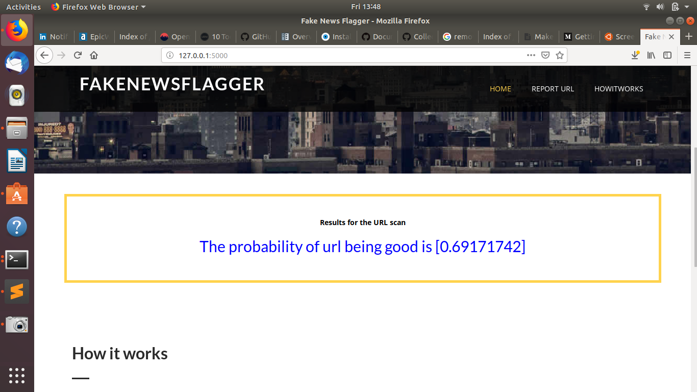

# FakeNewsFlagger
FakeNewsFlagger is an AI app to detect phishing website aimed at indentifying fake news site.

## Development Methodology
I trained a machine learning algorithm Naive Bayes Classifier- MultinomialNB to be specific.

After Modeling I deployed the app using Flask for backend, HTML, CSS, JS for frontend.

## Installation
Clone the repository with the following command.

```bash
git clone 
```

## Usage
Run the following command from bash inside the project
```bash
Pyton app.py 
```
## Screenshots




## Contributing
Pull requests are welcome. For major changes, please open an issue first to discuss what you would like to change.

## License
[MIT](https://choosealicense.com/licenses/mit/)


